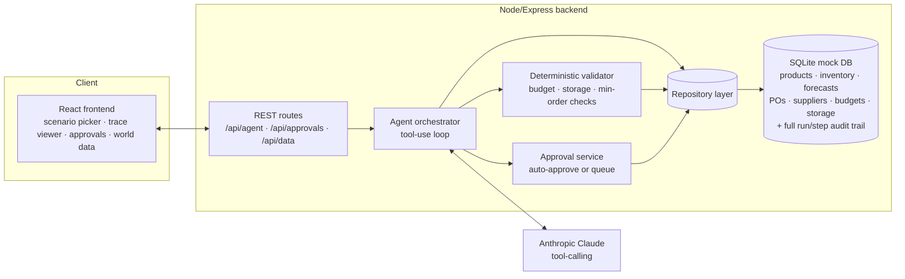

# AI Purchasing Agent

A full-stack AI agent that assists a retail/quick-commerce buyer: given a purchasing
situation, it investigates the relevant data, decides what should happen, takes
action where it's safe to, and validates the outcome — with a human-approval
safety net for anything large or uncertain.

Built for the Rappi "AI Purchasing Agent" take-home assignment.

**All four scenarios from the brief are implemented end-to-end**, on top of one
generic agent (not four separate scripts).

## Contents

- [Quick start](#quick-start)
- [Architecture](#architecture)
- [Approach](#approach)
- [The four scenarios](#the-four-scenarios)
- [Feedback loop & validation](#feedback-loop--validation)
- [Human approval](#human-approval)
- [Evaluation approach](#evaluation-approach)
- [Project layout](#project-layout)
- [Limitations & what I'd do next](#limitations--what-id-do-next)

## Quick start

Requires Node.js 18+.

```bash
# 1. Backend
cd backend
cp .env.example .env        # then paste your ANTHROPIC_API_KEY into .env
npm install
npm run seed                # creates & seeds backend/data/purchasing.db
npm run verify-data         # optional: sanity-checks the mock data (no LLM calls)
npm run dev                 # http://localhost:4000

# 2. Frontend (separate terminal)
cd frontend
cp .env.example .env        # defaults to http://localhost:4000, only change if needed
npm install
npm run dev                 # http://localhost:5173
```

Open `http://localhost:5173`, pick a scenario, and click **Run agent**. You'll see
the agent's tool-by-tool trace on the left and its final decision on the right.
Anything queued for sign-off shows up under the **Approvals** tab; **World data**
shows the live mock database.

To reset the mock world back to its starting state: `npm run reset-db` in `backend/`.

## Architecture



- **Backend**: Node.js + TypeScript + Express + SQLite (`better-sqlite3`). No ORM —
  a thin repository layer (`src/db/repository.ts`) so the SQL stays visible and
  auditable.
- **Agent**: Anthropic Claude with tool use (function calling). The model never
  talks to the database directly — every read and write goes through named tools
  with typed schemas (`src/agent/tools.ts`), so the model's capabilities are
  exactly what's on that list, nothing more.
- **Frontend**: React + Vite + TypeScript, talking to the backend over a small
  REST API. No agent framework on the frontend — it just renders the run's
  recorded trace and lets a human act on pending approvals.
- **Audit trail**: every reasoning step, tool call, tool result, and final
  decision is written to `agent_runs` / `agent_run_steps` as the agent runs, not
  reconstructed after the fact. That's what the trace viewer renders, and it's
  also how the evaluation script inspects a run afterwards.

## Approach

### Why one generic agent instead of four scenario scripts

All four scenarios in the brief are really the same underlying decision: *given a
proposed or implied purchase, is it actually justified, and if so, can it actually
be executed?* They differ in what triggers the situation (a recommendation, a
supplier shortfall, a demand spike, a known constraint), not in what information
is needed to resolve it. So there's one system prompt, one tool set, and one
orchestration loop (`src/agent/orchestrator.ts`); scenarios differ only in the
initial situation payload handed to the agent (`src/scenarios.ts`). This is also
what makes "describe your own situation" in the UI possible — it's not a
different code path, just a different starting message.

### Tools, not a monolithic prompt

The agent has 12 tools, split into two kinds:

**Investigation (read-only):** `get_product_info`, `get_inventory`,
`get_demand_forecast`, `get_open_purchase_orders`, `get_purchase_order`,
`get_supplier_terms`, `get_budget`, `get_storage_capacity`,
`check_purchase_constraints` (a dry-run check with no side effects).

**Action (mutating):** `create_purchase_order`, `modify_purchase_order`,
`cancel_purchase_order`, `escalate_to_human`, and `final_decision` (a structured
tool that ends the run and forces the agent to name its decision category, its
key factors, and its confidence — not free text I'd have to parse).

The system prompt (`src/agent/prompts.ts`) tells the agent *not* to trust the
recommendation/forecast/supplier message it's handed, to gather the relevant
categories of information before deciding, to dry-run constraints before
committing, and to escalate rather than guess when constraints genuinely
conflict. It does not hardcode scenario-specific logic — the reasoning about
"is 800 units too many given 250 units of storage headroom" happens in the
model's tool use, not in an if/else tree.

### `get_demand_forecast` does more than return a number

Rather than a single static forecast figure, this tool returns actual sales to
date, the elapsed vs. total period length, a computed run-rate, and the
run-rate-projected total for the period, so the agent can itself notice "sales
are running 140% ahead of forecast" instead of being told that conclusion. This
is what Scenario 3 (demand spike) hinges on.

## The four scenarios

Each is backed by mock data specifically designed to force a real trade-off
(see `backend/src/db/seed.ts` for exact numbers and rationale, and
`backend/src/scripts/verify_scenarios.ts` for a non-LLM check that the numbers
actually produce the intended conflict):

| # | Situation | The trap in the naive recommendation | Intended agent behaviour |
|---|---|---|---|
| 1 | System recommends 800 units of Cola at Bogotá DC | Storage has only ~250 units of headroom (tighter than the ~588-unit budget cap); true net need is ~400 | **Modify** down to what storage/budget actually allow, explain both constraints |
| 2 | A 500-unit chip PO can only be partly fulfilled (250 units) | A pricier alternate supplier exists with a low minimum order (50 units) | Source the 250-unit shortfall from the alternate supplier (small cost premium), rather than silently accepting the shortfall or escalating unnecessarily |
| 3 | Energy drink sales are running well above forecast | The existing PO was sized for the *stale* forecast, not the current run-rate | Detect the ~140% variance via run-rate projection, and expand the purchase to match the revised outlook |
| 4 | Shampoo needs restocking at Mexico City DC | Supplier's minimum order (500 units) costs more than the remaining budget allows (~346 units affordable) — the two constraints conflict with no valid quantity | **Escalate** rather than blindly place a 500-unit order that blows the budget |

## Feedback loop & validation

This was the part of the brief I spent the most deliberate design effort on.

1. **Every proposed purchase is checked against real numbers before it's treated
   as final**, via `checkPurchaseConstraints` (`src/agent/validate.ts`) — supplier
   minimum order, remaining budget, remaining storage capacity. This isn't the
   LLM's own arithmetic; it's a deterministic function querying the same tables
   the agent already investigated, so a hallucinated quantity can't sneak through
   just because the model claimed it was fine.
2. **`create_purchase_order` and `modify_purchase_order` run this check
   automatically** and hand the agent back the result (pass/fail, cost, storage
   needed, specific issues) as the tool's return value — not a separate step the
   model has to remember to call. If validation fails, the agent sees exactly
   why in the next turn and is instructed to react: adjust the quantity/supplier
   and retry, or cancel, or escalate. This is the literal feedback loop the
   brief describes: *"if the outcome is different from what the agent expected,
   the system should be able to handle that situation."*
3. **Nothing large or invalid becomes real by itself.** An order that passes
   validation and costs under the auto-approval threshold ($300, see
   `AUTO_APPROVE_MAX_COST`) is committed immediately — budget and storage ledgers
   update, PO status becomes `approved`. Anything larger, or anything that
   fails validation, is written to the `approvals` table and stays
   `pending_approval` until a human acts on it via the Approvals tab
   (`src/agent/approvalService.ts`). The PO exists and is visible, but its
   financial/storage footprint isn't committed until approved — so a rejected
   or ignored proposal never silently consumes real budget.
4. **A hard iteration cap** (`MAX_ITERATIONS = 14`) prevents a confused loop from
   running forever; if the agent can't reach `final_decision` in that budget,
   the orchestrator forces an escalation rather than returning nothing.

## Human approval

The policy is intentionally simple and stated as code, not left to the model's
judgement alone: **cost under $300 and passes validation → auto-approved. Anything
larger, or anything that fails validation → queued for a human.** The agent can
also proactively `escalate_to_human` for situations that are ambiguous or
genuinely conflicting even below that dollar threshold (this is what Scenario 4
is designed to trigger). Both paths land in the same `approvals` table and the
same UI queue, so a human reviewer has one place to look regardless of why
something needs their attention.

## Evaluation approach

Two layers, matching the brief's suggestion that this doesn't need to be a
sophisticated framework:

**1. Data-level checks, independent of the LLM** (`npm run verify-data` in
`backend/`). Before ever calling the model, this script asserts that the seeded
numbers actually create the trade-off each scenario is meant to test — e.g. that
Scenario 1's storage capacity really is tighter than its budget cap, that
Scenario 4's minimum order really is unaffordable, that Scenario 3's run-rate
really is anomalous. This catches "the mock data doesn't actually test anything"
before it ever reaches "did the agent decide correctly" — a bug at this layer
would make any LLM evaluation meaningless.

**2. Behavioural checks on the agent's run trace**, one per scenario, checking
the things the brief calls out explicitly:

| Check | How it's verified |
|---|---|
| Did it gather the necessary information? | Inspect `agent_run_steps` for `tool_call` entries — did it call `get_inventory`, `get_demand_forecast`, `get_open_purchase_orders`, `get_supplier_terms`, `get_budget`, and `get_storage_capacity` before deciding, not just some of them? |
| Did it respect constraints? | Compare the final PO's quantity/cost/storage footprint against the ceilings computed independently in `verify_scenarios.ts` |
| Was the decision category appropriate? | Compare `final_decision.decision` against the expected category in the table above (`modified` for Scenario 1, etc.) |
| Did it take the appropriate action? | Check `purchase_orders` / `approvals` for the actual side effect, not just what the agent *said* it would do |
| Did it validate the result? | Check that a `tool_result` step for `create_purchase_order`/`modify_purchase_order` includes a `validation` block, and that the agent's next step reacted correctly if `validation.ok` was `false` |
| What happens when the initial action doesn't work? | Scenario 4 is specifically designed so the "obvious" action (order the supplier minimum) fails validation — the trace should show the agent recognising that and escalating instead of forcing it through |

In practice, running each scenario from the UI and reading the trace panel is
the fastest way to check all of the above — the trace shows every tool call,
every validation result, and the final structured decision in order, so a
reviewer doesn't have to trust a summary. See `backend/src/scripts/verify_scenarios.ts`
output for the numeric ground truth to check the agent's decision against.

## Project layout

```
backend/
  src/
    db/            schema, seed data, repository (data access)
    agent/         tools, orchestrator, prompts, validation, approvals
    routes/        REST endpoints
    scripts/       verify_scenarios.ts — non-LLM data sanity check
    scenarios.ts   the 4 canned situations fed to the agent
frontend/
  src/
    components/    ScenarioPicker, RunTrace, DecisionPanel, ApprovalsQueue, WorldDataBrowser
    api.ts         backend client
    App.tsx        tab shell
```

##  What I'd do next

- The mock dataset is intentionally small (5 products, 2 nodes, 5 suppliers) so
  the numbers behind each scenario stay easy to verify by hand — a real deployment
  would need the same tool interface backed by real inventory/OMS/supplier
  systems, not a bigger version of this SQLite file.
- Auto-approval threshold ($300) and iteration cap (14) are simple constants for
  this demo; a real system would tune these per category/node and probably let
  a human configure them.
- I didn't build supplier-reliability-weighted sourcing (e.g. penalizing a
  historically-unreliable alternate supplier beyond its price) — `reliability_score`
  is seeded and available to the agent via `get_supplier_terms`, but the prompt
  doesn't specifically instruct the agent to weigh it. That's a natural next
  scenario given the "supplier reliability" idea in the brief's optional section.
- No automated LLM-graded eval loop (e.g. re-running scenarios N times to check
  decision stability) — given the "no sophisticated framework needed" note in
  the brief, I prioritized making each of the four scenarios individually
  legible and verifiable over building meta-evaluation tooling.

## A note on AI-assisted development

This solution was built with the help of Claude (Anthropic). I'm able to walk
through and modify any part of it — architecture, tool schemas, validation
logic, or the UI — in a follow-up discussion.
